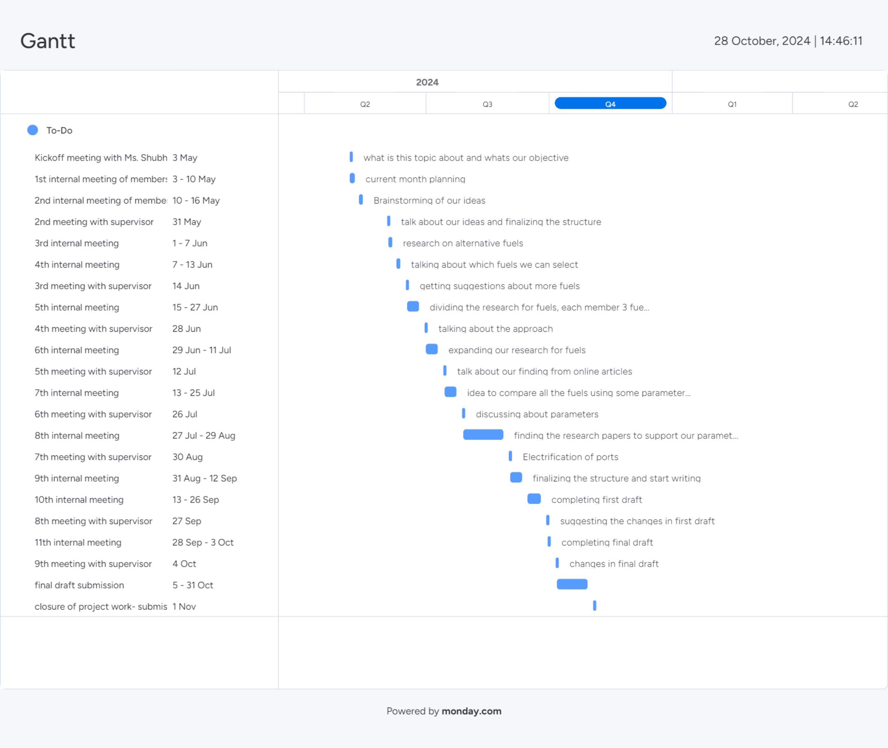
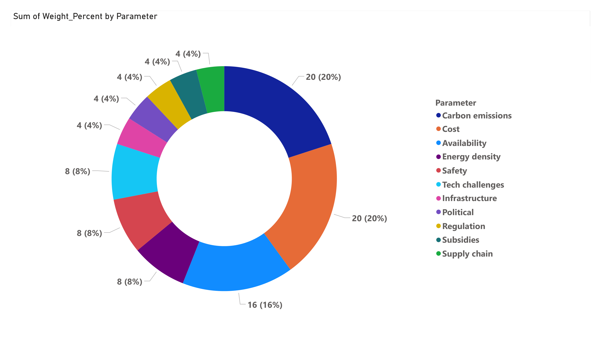
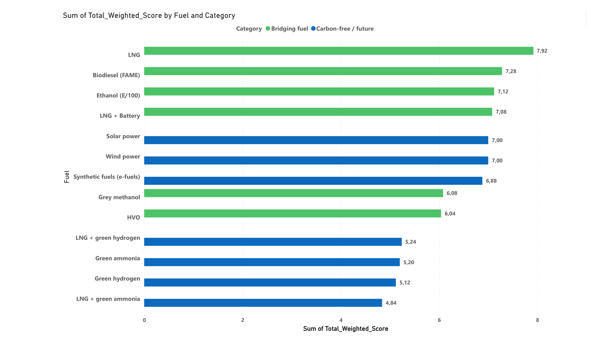
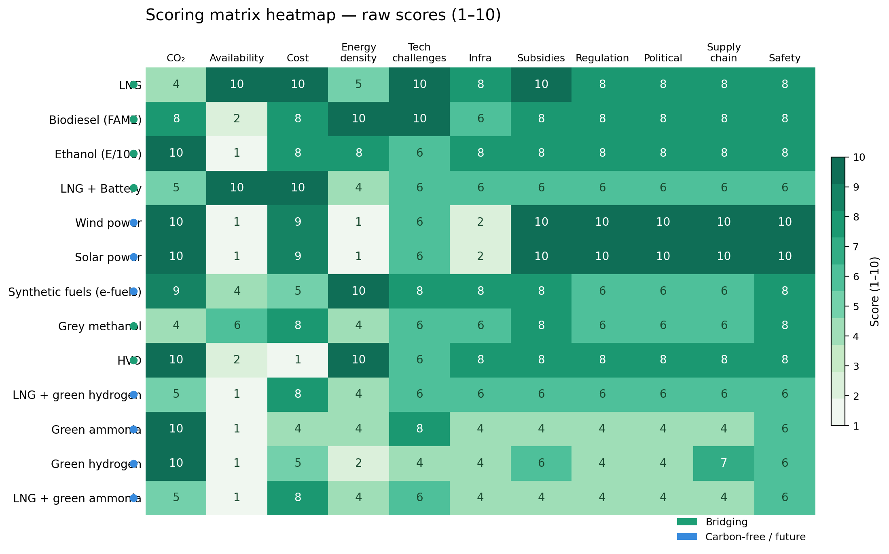

# Comprehensive Evaluation of Alternative Fuels for Sustainable Maritime Industry Transition

> **Research Project (Studienarbeit)** · Institut für Maritime Logistik (MLS), TU Hamburg · Grade: 1.7 · May–November 2024

---

## Overview

A data-driven research project evaluating **13 alternative marine fuels** across **11 weighted parameters** to identify the most viable decarbonization pathway for the maritime industry. Conducted at Fraunhofer CML / TU Hamburg under **Prof. Dr.-Ing. Carlos Jahn** and supervised by **Shubhangi Gupta**.

**Core finding:** LNG, Biodiesel (FAME), and LNG + Electric Battery were identified as the most commercially viable bridging fuels. Green hydrogen and green ammonia remain promising long-term candidates but lack infrastructure readiness today.

---

## My Role — Project Leader

- Defined scope, objectives, and timeline across 6 months
- Managed all tasks and milestones using Jira (Kanban board)
- Led literature review on fuel overview (13 fuel types)
- Authored the conclusion and final documentation
- Coordinated **9 supervisor meetings** and **11 internal team meetings**

---

## Project Management — Agile Approach

The project followed an **iterative, milestone-based workflow** using agile principles adapted for academic research:

**Sprint structure:** Work was organized in roughly 2-week cycles aligned with internal and supervisor meetings. Each cycle had a clear focus — from initial brainstorming (May) through literature division, parameter definition, scoring, drafting, and revision (Oct).

**Task management:** All tasks were tracked on a **Jira Kanban board** with columns for To-Do, In Progress, Review, and Done. Task ownership was clearly assigned per team member and topic area, ensuring accountability and parallel workstreams.

**Collaboration tools:**

| Tool | Purpose |
|------|---------|
| Jira | Task tracking, Kanban board, milestone management |
| Monday.com | Gantt chart — project timeline and dependencies |
| Miro | Mind mapping and brainstorming |
| Zotero | Reference management (100+ academic sources) |
| Zoom | Bi-weekly supervisor check-ins and team standups |
| LaTeX | Standardized report formatting |
| Power BI | Data visualization and dashboard reporting |

**Deliverables were iterative** — a first draft was completed mid-September, reviewed by the supervisor, revised through two feedback cycles, and finalized by November 1.



*Project Gantt chart — 6-month timeline from kickoff to submission*

---

## Methodology — Weighted Scoring Matrix

### How the scoring works

Parameters were grouped into **5 importance tiers** based on peer-reviewed literature on maritime fuel adoption:

**Tier 1 — weight 0.20 (critical):** Carbon emissions (WtW CO₂eq/MJ) · Cost (USD/mmBTU)

**Tier 2 — weight 0.16 (major):** Port availability worldwide

**Tier 3 — weight 0.08 (significant):** Safety · Technology readiness (TRL-based) · Volumetric energy density

**Tier 4 — weight 0.04 (moderate):** Infrastructure needs · Existing subsidies · Regulation · Political environment · Supply chain challenges

Each fuel was scored **1–10** per parameter using quantitative thresholds (e.g., specific CO₂eq/MJ ranges, USD/mmBTU price bands) derived from DNV's Alternative Fuels Insight platform, IRENA, IEA, and IMO reports. Scores were multiplied by weights and summed to produce a final composite score.



*Donut chart — parameter weight distribution across 11 criteria*

---

## Results

### Weighted score ranking — all 13 fuels



*Horizontal bar chart — final composite scores. LNG (7.92), Biodiesel (7.28), and LNG + Battery (7.08) rank highest.*

### Heatmap — raw scores across all parameters



*Heatmap showing each fuel's raw score (1–10) per parameter. Darker = higher score.*

### Core insight

Bridging fuels are not the final destination — they are a necessary stepping stone. The risk is **carbon lock-in**: over-investment in LNG infrastructure may delay the transition to fully zero-emission fuels. Regulatory frameworks must balance short-term practicality with long-term emission targets.

---

## Team

| Name | Responsibilities |
|------|-----------------|
| **Swarit Dinesh Tiwari** | Project Leader · Fuel overview · Conclusion · Project management documentation |
| César Andrés Navarrete Álvarez | Evaluation parameters · Implementation · Scoring methodology |
| Elton Dias | Hybrid fuels · Electrification of ports · Introduction |

All members contributed to literature research, brainstorming, and bridging fuel analysis.

---

## Repository Structure

```
├── README.md
├── report/
│   └── Alternative_Fuels_Maritime_Research_Report.pdf
├── images/
│   ├── weighted_score_ranking.png
│   ├── scoring_heatmap.png
│   ├── parameter_weights.png
│   └── gantt_chart.png
```

---

## Disclaimer

This project was completed as part of the Research Project (Studienarbeit) module at the Institut für Maritime Logistik (MLS), Technische Universität Hamburg-Harburg, WS 2023/24. All findings are based on literature available up to October 2024. This is an academic research project and does not constitute professional engineering or policy advice.
